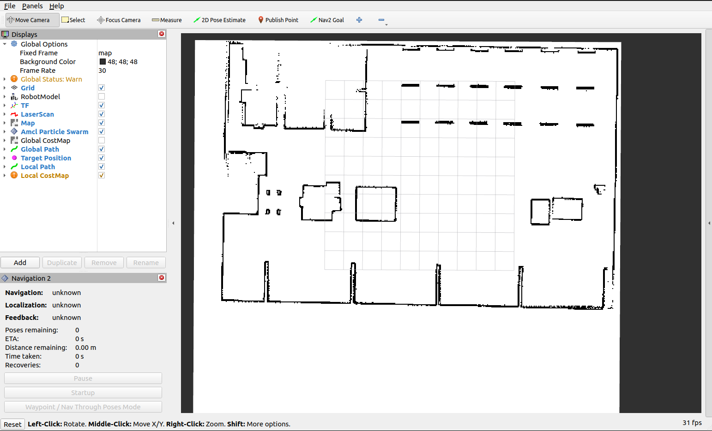
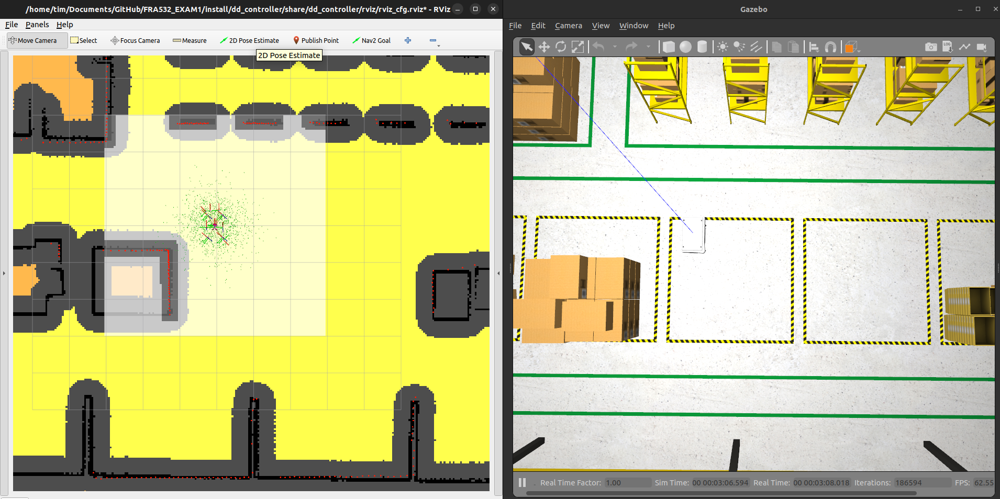
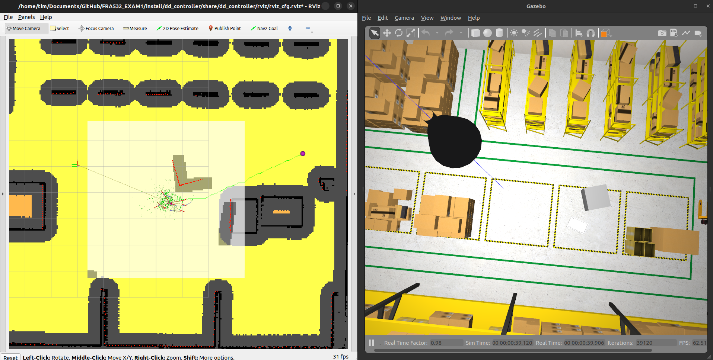
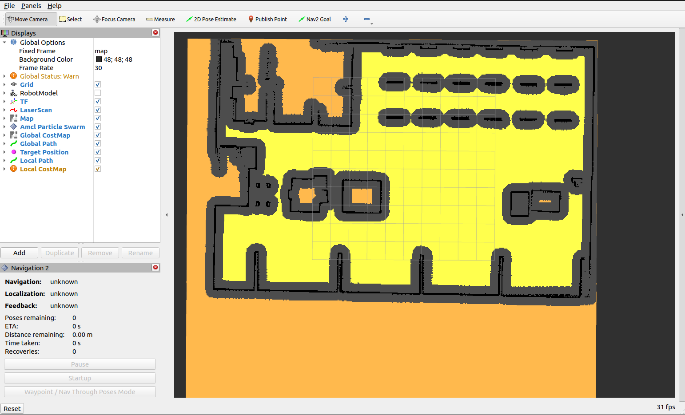
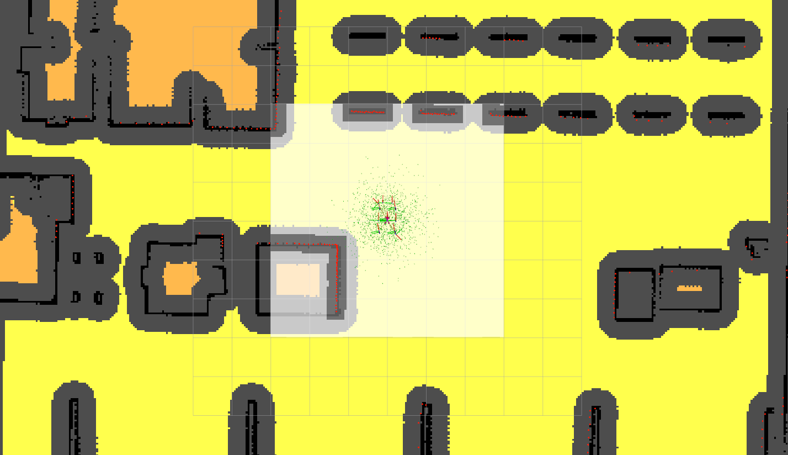

# FRA532_EXAM1: Path Planning and Navigation


## Demo (Click on the picture to watch)
[](https://youtu.be/PwrDWScAZx4)


## Introduction
This is the first examination for **FRA532 Mobile Robotics**, where I have the flexibility to choose my project. My chosen project focuses on developing autonomous navigation for a **differential drive mir_robot** which can avoid the local static obstacle in a warehouse environment.

## Packages Usage

### Existing Packages
- **SLAM and AMCL Localization** - [NAV2 Package]()
- **Robot's Model** - [MIR Robot](https://github.com/relffok/mir_robot)
- **Gazebo World** - [AWS RobotMaker](https://github.com/aws-robotics/aws-robomaker-small-warehouse-world)

**All of them are provided by Aj.Nook Github** !!

### Developed Packages
- **Global Planner** (A*)
- **Global and Local CostMap**
- **Local Planner + Controller** (Sampling-Based Model Predictive Control - SBMPO)

---

## Table of Contents
1. [Introduction](#introduction)
2. [Installation](#installation)
3. [Usage](#usage)
4. [Features](#features)
5. [Contributor](#contributor)

---

## Installation

### Python Packages

> **⚠ WARNING:** Make sure you have Python version **>= 3.6** installed.

Install the required Python dependencies:

```bash
pip install rclpy geometry-msgs nav-msgs sensor-msgs numpy scipy pillow pyyaml tf-transformations ament-index-python
```

### ROS2 Packages

> **⚠ WARNING:** Ensure you have **ROS2 Humble** and **Gazebo Classic** installed.

Install necessary ROS2 dependencies:

```bash
sudo apt install ros-humble-robot-state-publisher
sudo apt install ros-humble-ros2-control
sudo apt install ros-humble-ros2-controllers
sudo apt install ros-humble-gazebo-ros2-control
```

### Clone Workspace

Follow the commands below to download and install the package:

1. Navigate to the home directory:

    ```bash
    cd
    ```

2. Clone the repository and change directory to the workspace:

    ```bash
    git clone https://github.com/itsnotthetim/FRA532_EXAM1.git
    cd FRA532_EXAM1
    ```

3. Ensure all required package dependencies (MIR Robot) are installed:

    ```bash
    sudo apt update
    sudo apt install -y python3-rosdep
    rosdep update --rosdistro=humble
    rosdep install --from-paths src --ignore-src -r -y --rosdistro humble
    ```

4. Build and source the packages:

    ```bash
    colcon build
    source install/setup.bash
    echo "source ~/FRA532_EXAM1/install/setup.bash" >> ~/.bashrc
    ```

---

## Usage

1. Launch the Gazebo world and **mir_robot**

    ```bash
    ros2 launch fra532_gazebo sim.launch.py
    ```
    1.2 <mark>**What if you want to collect the map data**</mark>, Lauch the **fra532_slam** that was provided by Aj.Nook and then use the Xterm interface to move the robot to explore the map <mark>(You can skip this because I already do it for you)</mark>


    ```bash
    ros2 launch fra532_slam mapping.launch.py
    ```
    1.3 For saving the map, Launch the **save_map.launch.py** and then rename both of map file to map.pgm and map.yaml and move them to the **dd_controller/map** path <mark>(You can skip this because I already do it for you)</mark>

    ```bash
    ros2 launch dd_controller save_map.launch.py
    ```
2. Launch the **Localization and CostMap**:

    ```bash
    ros2 launch dd_controller loc_map.launch.py
    ```
    
3. Run the **SBMPO Controller Node**:

    ```bash
    ros2 run dd_controller sbmpo_controller.py
    ```

4. In **Rviz2**, use `2D Pose Estimate`. Click on the robot's spawn position and drag in the robot's heading direction.

    

5. In **Rviz2**, use `Publish Point` to determine the goal position. The robot will start navigating.

    

---

# Features

## Global Costmap Node

### Overview
The **Global Costmap Node** is a ROS2 implementation that generates and publishes a **global costmap** for navigation. This costmap is used by path planners and controllers to avoid obstacles and navigate efficiently. The node processes a **static map** (loaded from a `.pgm` image and `.yaml` file), inflates obstacles based on robot size, and publishes the costmap as an `OccupancyGrid` message.

---

### Algorithm
#### **Map Processing and Costmap Generation**
The global costmap is generated based on a static map (`.pgm` file) and metadata (`.yaml` file). It follows these steps:
1. **Load the static map** from the `.pgm` file.
2. **Extract metadata** from the `.yaml` file (resolution, origin, thresholds).
3. **Inflate obstacles** based on the robot’s size and a safety margin.
4. **Convert the processed map into an `OccupancyGrid` message** and publish it.


#### **Equations for Costmap Cell Computation**
The costmap grid is defined as:

   $$ cell_x = \frac{x - origin_x}{resolution}, \quad cell_y = \frac{y - origin_y}{resolution}$$

where:
-  $x, y $ are world coordinates
-  $origin_x, origin_y$  are map origin coordinates
-  $resolution$  is the grid resolution (meters per cell)

Each grid cell is classified as:
    $\text{Cost} =
    \begin{cases}
        100, & \text{if occupied (obstacle)} - Black\\
        0, & \text{if free space} - Yellow \\
        50, & \text{if unknown} - Orange
    \end{cases}$
    

---

### Costmap Inflation
#### **Obstacle Expansion for Safe Navigation**
Since a robot cannot navigate safely near walls or obstacles, the costmap inflates obstacles based on the robot’s **radius** and an additional **safety margin**.

#### **Inflation Calculation**
The inflation radius is computed as:
   $ R_{inflation} = \frac{robot\_radius + safety\_margin}{resolution} \times inflation\_factor$

where:
-  $R_{inflation}$  is the inflation radius in grid cells
- `robot_radius` is the physical size of the robot
- `safety_margin` is an extra buffer to prevent collisions
- `resolution` is the map resolution (meters per grid cell)
- `inflation_factor` scales inflation (default: 1.5)

Obstacles are inflated using **binary dilation** with a circular structuring element of radius \( R_{inflation} \).

---

### ROS2 Implementation
#### **1. Costmap Class**
- Loads the `.pgm` map file and its associated `.yaml` file.
- Extracts map properties such as resolution, origin, and thresholds.
- Inflates obstacles based on robot radius and safety margin.
- Provides a method `get_cost(x, y)` to retrieve costmap values.

#### **2. Costmap Node**
- **Subscribes to:**
  - `/amcl_pose` → Robot's estimated position
- **Publishes:**
  - `/global_costmap` → Processed occupancy grid
- **Updates the costmap** at **1 Hz** (every second).

---

#### ROS2 Topics
| Topic              | Type                          | Role |
|--------------------|-----------------------------|------|
| `/amcl_pose`       | `PoseWithCovarianceStamped` | Robot pose estimate (sub)|
| `/global_costmap`  | `OccupancyGrid`             | Published costmap for navigation (pub) |

---

## Local Costmap Node

### Overview
The **Local Costmap Node** is a ROS2 implementation similar to the **Global Costmap Node** but operates in **real-time** based on **LiDAR sensor data** instead of a static map. This allows the robot to dynamically detect and avoid obstacles that are not present in the global costmap.

**The Differences from the Global Costmap Node:**
- Uses **LiDAR (`/scan`)** instead of a **static map**.
- **Robot-centric (6m x 6m)** costmap, continuously updating in real-time.
- Obstacles **do not rotate** with the robot, preserving the global reference frame.
- **Publishes a transform (`/tf`)** to attach the costmap to the robot.
- Runs at a **high frequency (100 Hz)** for real-time updates.

---

### Features in Local Costmap
#### **1. LiDAR-Based Dynamic Obstacle Detection**
Unlike the **Global Costmap Node**, which loads a **predefined static map**, the **Local Costmap Node** actively updates obstacles detected by **LiDAR (`/scan`)**. The process follows:
1. **Convert each LiDAR range reading** to an obstacle position in the **global frame**.
2. **Translate world coordinates** into **costmap grid indices**.
3. **Mark occupied cells (`100`)** in the costmap grid.
4. **Apply inflation** for safety (like in the global costmap but in real-time).

#### **2. Real-Time Costmap Updates**
- The local costmap updates at **100 Hz**, ensuring the robot reacts to dynamic obstacles **immediately**.
- Uses **binary dilation** to apply **inflation layers** for safe navigation.

#### **3. Frame Attachment with TF**
- The node **broadcasts a transform (`/tf`)** from `map` to `local_costmap`.
- Ensures the costmap remains aligned with the **map frame** instead of rotating with the robot. (Like Nav2 package)

#### **4. Topic **
The **Local Costmap Node** introduces the following additional topics:

| Topic              | Type                          | Role |
|--------------------|-----------------------------|------|
| `/scan`           | `LaserScan`                   | LiDAR-based obstacle detection (sub) |
| `/tf`             | `TransformStamped`            | Attach local costmap to robot frame (pub) |

---

## A* Global Planner Node - README

### Overview
The **A* Global Planner Node** is a ROS2 implementation of the **A* (A-star) pathfinding algorithm**. It computes an **optimal global path** for the robot based on a **costmap (`/global_costmap`)**, allowing the robot to navigate efficiently from a **start position** to a **goal location**.

This node:
- **Subscribes to the global costmap (`/global_costmap`)**.
- **Receives the robot’s start position (`/amcl_pose`)**.
- **Waits for a goal point (`/clicked_point`)** from an operator.
- **Runs the A* search algorithm** to find an optimal path.
- **Publishes the computed path (`/global_path`)** for execution.

---

### Algorithm
#### **1. A* Pathfinding Overview**
A* is an informed search algorithm that finds the shortest path from a **start node** to a **goal node** in a grid-based environment. It maintains a list of explored nodes and prioritizes those that have the lowest estimated total cost.

##### **Equation for A* Cost Function**
Each node in the search space is evaluated using the cost function:

   $$ f(n) = g(n) + h(n)$$

where:
-  $f(n)$  = total estimated cost from start to goal through node  $n$ 
-  $g(n)$  = actual cost from the start node to  $n$ 
-  $h(n)$  = heuristic cost (estimated cost from $n$  to the goal)

A* uses a **priority queue (min-heap)** to expand nodes with the lowest $f(n)$ first.

#### **2. Heuristic Function**
This node uses the **Euclidean distance heuristic**:

   $$ h(n) = \sqrt{(x_{goal} - x_n)^2 + (y_{goal} - y_n)^2}$$

This heuristic provides a direct distance estimation between the current node and the goal, ensuring efficient pathfinding.

#### **3. Neighbor Expansion**
The planner considers **8-connected movement**, allowing the robot to move:
- Up, Down, Left, Right (**cardinal directions**)  $$(dx, dy) = \{(\pm1, 0), (0, \pm1)\} $$
- Diagonal moves (**intercardinal directions**) \( (dx, dy) = \{(\pm1, \pm1)\} \)
- Each movement is assigned a cost based on Euclidean distance and occupancy cost from the costmap.

#### **4. Path Reconstruction**
Once the goal node is reached, the algorithm **traces back** the optimal path using a **came-from dictionary**
    $$path = \text{retrace}(goal \rightarrow start)$$

This path is then converted to world coordinates and published.

---

### ROS2 Implementation
#### **1. A* Global Planner Class**
- **Listens to the `/global_costmap`** for obstacle information.
- **Receives the `/amcl_pose`** to determine the robot’s current position.
- **Processes a clicked goal (`/clicked_point`)** from the user interface.
- **Executes A* search and publishes the computed `/global_path`**.

#### **2. A* Global Planner Node**
- **Subscribes to:**
  - `/global_costmap` → Provides the environment’s obstacles.
  - `/amcl_pose` → Provides the robot’s current position.
  - `/clicked_point` → Receives the goal position.
- **Publishes:**
  - `/global_path` → Computed shortest path.

---

### ROS2 Topics
| Topic              | Type                          | Role |
|--------------------|-----------------------------|------|
| `/global_costmap` | `OccupancyGrid`              | Static environment map |
| `/amcl_pose`      | `PoseWithCovarianceStamped`  | Robot’s estimated position |
| `/clicked_point`  | `PointStamped`               | User-defined goal location |
| `/global_path`    | `Path`                        | Computed optimal path |

---


## SBMPO Controller Node - README

### Overview
The **SBMPO (Sampling-Based Model Predictive Optimization) Controller Node** is a ROS2 implementation of a **local planner and controller** that generates **collision-free trajectories** for a mobile robot. It samples multiple candidate velocities, simulates their trajectories, and selects the optimal one based on a **cost function**.

This node:
- **Subscribes to:**
  - `/amcl_pose` → Robot’s current position.
  - `/global_path` → Path provided by the global planner.
  - `/local_costmap` → Real-time costmap for obstacle avoidance.
- **Publishes:**
  - `/cmd_vel` → Safe velocity commands for robot motion.
  - `/local_path` → Visual representation of the best trajectory.
- **Uses a model-predictive approach** to generate optimal motion commands while avoiding obstacles dynamically.

---

### Algorithm
#### **1. Motion Prediction and Trajectory Sampling**
The planner **samples multiple linear (`v`) and angular (`w`) velocities** and predicts their future motion using the kinematic model:

$$
    x_{t+1} = x_t + v \cos(\theta_t) \cdot dt
$$
$$
    y_{t+1} = y_t + v \sin(\theta_t) \cdot dt
$$
$$
    \theta_{t+1} = \theta_t + w \cdot dt
$$
where:
-  $x_t, y_t, \theta_t$  → Current robot position and heading angle.
-  $v$  → Linear velocity (m/s).
-  $w$  → Angular velocity (rad/s).
-  $dt$  → Simulation time step.

Each trajectory is evaluated over a **horizon time (`horizon`)** to determine its feasibility and cost.

#### **2. SBMPO Cost Function for Trajectory Selection**
Each trajectory candidate is evaluated using the **SBMPO cost function**:
$$
    C_{total} = C_{obs} + C_{path} - R_{forward} + C_{clearance}
$$
where:
-  $C_{obs} = W_{obs} \times \frac{cost(x, y)}{100}$  → **Obstacle proximity penalty**: Increases cost for paths close to obstacles.
-  $C_{path} = W_{path} \times d_{path}(x, y)$  → **Path deviation penalty**: Penalizes deviation from the planned global path.
-  $R_{forward} = W_{forward} \times v$  → **Forward motion reward**: Encourages the robot to move forward instead of stopping.
-  $C_{clearance}$  → **Low-clearance penalty**: Penalizes paths that navigate too close to obstacles, encouraging safer paths.

##### **Variable Definitions**:
| Variable         | Description |
|-----------------|-------------|
|  $C_{obs}$  | Obstacle proximity penalty; increases if the trajectory gets too close to obstacles. |
|  $W_{obs}$   | Weight coefficient for obstacle penalty (adjustable parameter). |
|  $cost(x, y)$  | Costmap value at position  $(x, y)$ , scaled to [0,100]. |
|  $C_{path}$  | Path deviation penalty; penalizes trajectories that deviate from the planned path. |
|  $W_{path}$  | Weight coefficient for path deviation (adjustable parameter). |
|  $d_{path}(x, y)$  | Euclidean distance from trajectory point  $(x, y)$  to the closest global path point. |
|  $R_{forward}$  | Forward motion reward; encourages the robot to move forward. |
|  $W_{forward}$  | Weight coefficient for forward reward (adjustable parameter). |
|  $v $ | Linear velocity of the trajectory candidate. |
|  $C_{clearance}$  | Clearance penalty; penalizes paths with insufficient obstacle clearance. |

If a trajectory results in a predicted collision within **emergency time-to-collision (`emergency_ttc`)**, it is immediately **discarded**.

#### **3. Trajectory Execution**
- The **lowest-cost trajectory** is selected and executed.
- If **no valid forward motion is found**, the controller attempts:
  1. **Reverse motion** (negative `v`).
  2. **Rotation in place** (zero `v`, maximum `w`).
  3. **Emergency stop** if no feasible option exists.

---

### ROS2 Implementation
#### **1. SBMPO Controller Class**
- Samples multiple **(v, w) trajectory candidates**.
- Predicts future robot motion.
- Evaluates trajectories using the **SBMPO cost function**.
- Selects the best trajectory and **publishes `/cmd_vel`**.

#### **2. SBMPO Controller Node**
- **Subscribes to:**
  - `/amcl_pose` → Current robot pose.
  - `/global_path` → Precomputed path from the global planner (to update the path).
  - `/local_costmap` → Real-time environment updates.
- **Publishes:**
  - `/cmd_vel` → Safe velocity command for robot motion.
  - `/local_path` → Visual representation of the selected trajectory.

---

### ROS2 Topics
| Topic              | Type                          | Role |
|--------------------|-----------------------------|------|
| `/amcl_pose`       | `PoseWithCovarianceStamped` | Robot’s estimated position. |
| `/global_path`     | `Path`                       | Global path from the planner. |
| `/local_costmap`   | `OccupancyGrid`              | Local obstacle map. |
| `/cmd_vel`         | `Twist`                      | Published velocity commands. |
| `/local_path`      | `Path`                       | Planned local trajectory for visualization. |

---


## Contributor


 **Karanyaphas Chitsuebsai** (65340500065)

